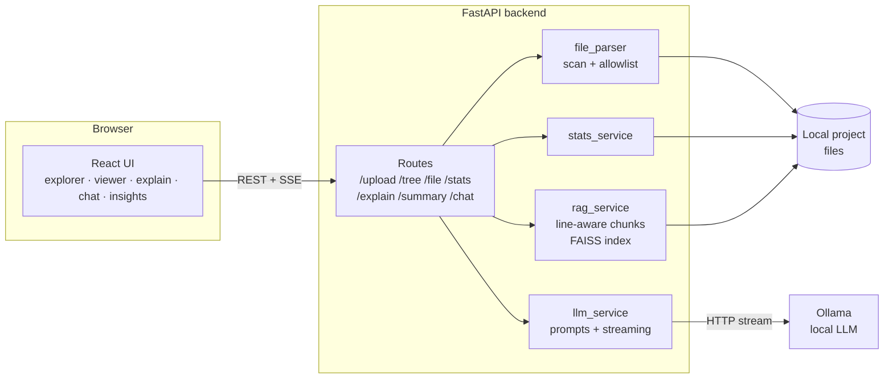

# DevLens AI

**An offline, AI-powered codebase explainer.** Point DevLens at any local project and get streaming explanations, code reviews, a project summary, codebase statistics, and a multi-turn chat that answers questions about your code with clickable, line-level citations. Everything runs on your machine against a local LLM ([Ollama](https://ollama.com)), so no code ever leaves your computer.


---

## Highlights

- **Retrieval-Augmented Generation over your code.** Files are split into line-aware chunks, embedded with `sentence-transformers`, and searched with FAISS. Answers cite exact ranges such as `routes/file.py:L1-49`; clicking a citation opens the file with those lines highlighted.
- **Conversational follow-ups.** Chat keeps recent turns as memory, and retrieval combines the previous question with the follow-up, so "what status code does it return?" still finds the right code.
- **Token-by-token streaming.** Every LLM endpoint streams over Server-Sent Events, end to end through FastAPI, the Vite proxy, or nginx. Responses can be stopped mid-way and stale streams are cancelled automatically.
- **Codebase insights.** Language breakdown, line counts, project size, and the largest files, computed from the same allowlisted files the explorer shows.
- **Fully local and containerised.** One `docker compose up` runs the app; the embedding model is baked into the image so retrieval works offline.
- **Tested and linted in CI.** 46 backend tests (pytest, Ollama mocked) and 21 frontend tests (Vitest), plus `ruff` and a production build on every push.

---

## Features

| Feature | Description |
|---|---|
| Project explorer | Load any folder by path; VS Code-style tree with a quick file filter |
| Code viewer | Syntax highlighting for 20+ languages, line-range highlighting |
| AI explanations | Four modes: Explain, ELI5, Code Review, Optimization |
| Confusion detector | Finds the most complex sections of a file and simplifies them |
| Project summary | Architecture overview built from a snapshot of the whole codebase |
| Codebase chat | Multi-turn RAG Q&A with clickable `file:Lstart-end` citations |
| Insights | Files, lines, size, lines per language, largest files |
| Export | Download any explanation, summary, or chat transcript as Markdown |
| Model picker | Switch between any model installed in Ollama |
| Status badge | Shows whether the backend and Ollama are reachable; recovers automatically |
| Remembered settings | Last project path and model restored on reload (browser-only storage) |

---

## Architecture



In development the Vite dev server proxies API calls to the backend; in Docker, nginx serves the built UI and proxies the API with buffering disabled so SSE tokens arrive immediately.

### How codebase chat works

1. **Index (on upload, in the background).** Every allowlisted file is split into chunks of whole lines (up to ~1,500 characters, 3 lines of overlap). Each chunk records its `start_line` and `end_line`. Chunks are embedded with `all-MiniLM-L6-v2` and stored in an in-memory FAISS index, cached per project.
2. **Retrieve.** The question, plus the previous question when the user is following up, is embedded and the top-k nearest chunks are fetched. Embedding and search run in a worker thread to keep the event loop free.
3. **Generate.** Retrieved chunks are formatted with their file and line range, combined with recent conversation turns, and streamed to the model with instructions to answer only from the context and cite line ranges.
4. **Cite.** After the answer, the backend sends de-duplicated citations (`path`, `start_line`, `end_line`), which the UI renders as clickable chips.

---

## Quick start with Docker

Requires Docker and [Ollama](https://ollama.com) on the host.

```bash
ollama pull mistral          # or any model you prefer

# Mount the folder that contains your projects (read-only)
PROJECTS_DIR=/path/to/your/code docker compose up --build
```

Open **http://localhost:8080** and load a project by its path inside the container, for example `/projects/my-app`.

| Variable | Default | Description |
|---|---|---|
| `PROJECTS_DIR` | `.` | Host folder mounted read-only at `/projects` |
| `OLLAMA_URL` | `http://host.docker.internal:11434` | Ollama server reachable from the container |
| `OLLAMA_MODEL` | `mistral` | Default model |
| `DEVLENS_PORT` | `8080` | Port the UI is published on (bound to `127.0.0.1` only) |

---

## Manual setup

### 1. Ollama

```bash
curl -fsSL https://ollama.com/install.sh | sh   # see ollama.com for Windows/macOS
ollama pull mistral
ollama serve                                    # listens on port 11434
```

### 2. Backend

```bash
cd backend
python -m venv .venv
source .venv/bin/activate   # Windows: .venv\Scripts\activate
pip install -r requirements.txt

uvicorn main:app --reload --host 127.0.0.1 --port 8000
# ...or load settings from a .env file:
uvicorn main:app --reload --host 127.0.0.1 --port 8000 --env-file ../.env
```

Keep the server on `127.0.0.1`: the browser reaches it through the Vite proxy, and binding to `0.0.0.0` would expose your file system to the network.

### 3. Frontend

```bash
cd frontend
npm install
npm run dev
```

Open **http://localhost:5173**.

### Configuration

| Variable | Default | Used by | Description |
|---|---|---|---|
| `OLLAMA_URL` | `http://localhost:11434` | backend | Base URL of the Ollama server |
| `OLLAMA_MODEL` | `mistral` | backend | Default model when none is selected |
| `DEVLENS_API_URL` | `http://localhost:8000` | Vite dev server | Backend the dev proxy forwards to |

Copy `.env.example` to `.env` to keep backend settings in a file.

---

## Using DevLens

1. Enter the **absolute path** of a project and click **Load Project**.
2. Click a file to view it; type in **Filter files** to narrow the tree (Esc clears it).
3. Pick a mode (Explain / ELI5 / Review / Optimize) and click **Explain File**, or **Detect Confusion**.
4. Click **Project Summary** for an architecture overview of the whole codebase.
5. Open **Chat** and ask questions; ask follow-ups naturally. Click a citation to jump to the cited lines.
6. Open **Insights** for language and size statistics; click a large file to open it.
7. **Stop** cancels any response (text so far is kept); **Copy** and **Export** save results.

---

## Engineering notes

- **Streaming end to end.** `llm_service` reads Ollama's newline-delimited JSON stream and yields tokens; routes wrap them as SSE events (`token`, `sources`, `error`, `done`). The frontend parses SSE from a `fetch` stream (handling events split across network chunks) and supports cancellation via `AbortController`.
- **Non-blocking backend.** File reads use `aiofiles`; directory scans, embedding and FAISS search run in worker threads; one pooled HTTP client is reused for Ollama and closed on shutdown.
- **Warm caches.** The parsed tree is cached at upload, and the RAG index is pre-built in a retained background task so the first chat query is fast. A lock prevents concurrent duplicate index builds.
- **Prompt budgets.** Code sent for explanation is capped at 50,000 characters, RAG context at 30,000, and chat memory at 6 turns of 2,000 characters each.
- **Small bundle.** The code viewer uses `PrismLight` with only the languages DevLens opens, cutting the JavaScript bundle from 846 KB to about 340 KB.

---

## Development

```bash
# Backend: lint and tests (Ollama and the embedding model are mocked)
cd backend
pip install -r requirements-dev.txt
ruff check .
python -m pytest

# Frontend: unit tests and production build
cd frontend
npm test
npm run build
```

GitHub Actions runs these checks on every push and pull request to `main`.

---

## API reference

LLM-backed endpoints return **Server-Sent Events** (`text/event-stream`).

| Event type | Payload | Meaning |
|---|---|---|
| `token` | string | One generated token |
| `sources` | `{ path, start_line, end_line }[]` | Citations (chat only) |
| `error` | string | An error occurred |
| `done` | — | The stream finished |

| Method | Endpoint | Description |
|---|---|---|
| POST | `/upload` | Register a project `{ "path": "/abs/path" }` |
| GET | `/tree` | File-tree JSON |
| GET | `/file?path=<rel>` | A file's content |
| GET | `/stats` | Files, lines, size, languages, largest files |
| POST | `/explain` | Explain code `{ code, mode, model }` (streamed) |
| POST | `/explain/confusion` | Confusing sections `{ code, model }` (streamed) |
| POST | `/summary` | Project summary `{ model }` (streamed) |
| POST | `/chat` | RAG Q&A `{ question, top_k, model, history }` (streamed) |
| GET | `/models` | Installed models and the default |
| GET | `/health` | Backend liveness and Ollama reachability |

`history` is a list of earlier `{ "role": "user" | "assistant", "content": "..." }` turns.

---

## Security

- Only allowlisted source-file types up to 100 KB are read; dependency, build, and cache folders are skipped.
- `/file` resolves paths against the project root and rejects traversal attempts with HTTP 403.
- The Docker setup mounts projects read-only, runs the backend as an unprivileged user, and publishes the UI on `127.0.0.1` only.
- All AI features run against your own Ollama instance; no code is sent to external services.

---

## Project structure

```
DevLens-AI/
├── docker-compose.yml
├── backend/
│   ├── Dockerfile
│   ├── main.py                  # FastAPI app, routers, validation errors, /health
│   ├── routes/                  # upload, tree, file, stats, explain, summary, chat, models
│   ├── services/
│   │   ├── file_parser.py       # Recursive scan → tree + flat file list
│   │   ├── rag_service.py       # Line-aware chunking, FAISS index, citations
│   │   ├── llm_service.py       # Ollama streaming client + prompt templates
│   │   └── stats_service.py     # Language and size metrics
│   ├── utils/file_utils.py      # Allowlist, size limits, safe reads
│   └── tests/                   # pytest suite
└── frontend/
    ├── Dockerfile, nginx.conf   # Static build served by nginx with SSE proxy
    └── src/
        ├── App.jsx
        ├── components/          # Sidebar, FileTree, CodeViewer, ExplanationPanel,
        │                        # ChatPanel, InsightsPanel, FormattedText, StatusIndicator, …
        ├── services/api.js      # REST + SSE client
        └── utils/               # tree filter, downloads, preferences
```
